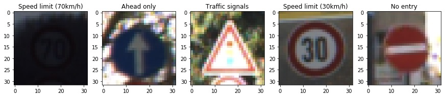
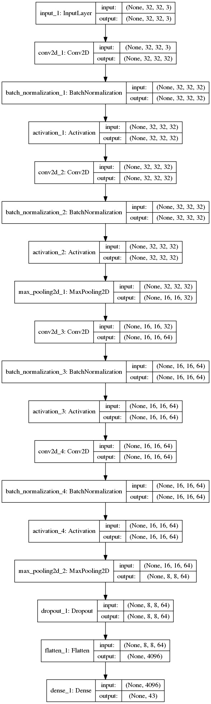
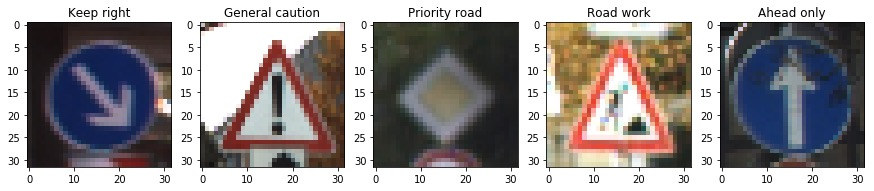
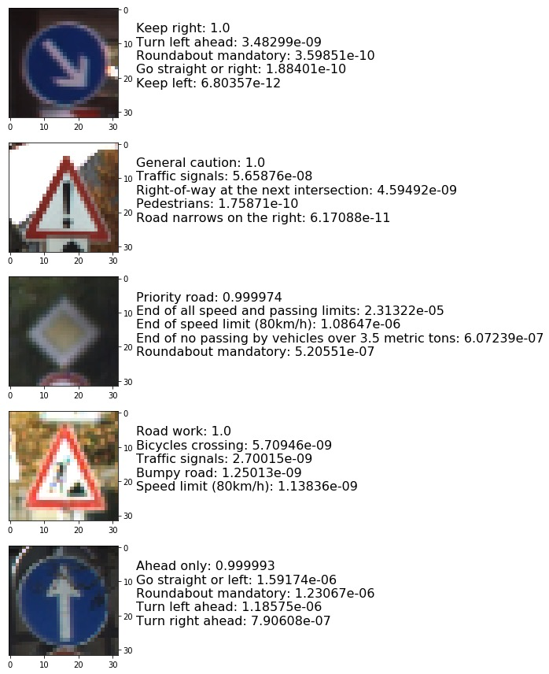

#**Traffic Sign Recognition** 

**Build a Traffic Sign Recognition Project**

The goals / steps of this project are the following:
* Load the data set ([German Traffic Sign Dataset](http://benchmark.ini.rub.de/?section=gtsrb&subsection=dataset))
* Explore, summarize and visualize the data set
* Design, train and test a model with modified VGG16 architecture
* Use the model to make predictions on new images
* Analyze the softmax probabilities of the new images
* Summarize the results with a written report

## Rubric Points
#### Here I will consider the [rubric points](https://review.udacity.com/#!/rubrics/481/view) individually and describe how I addressed each point in my implementation.

###Data Set Summary & Exploration

#### 1. Split the data set, print shape of every part of the data set using Python.

This task is quite simple, so I hae done it using numpy, pandas or other built-in method.

* The size of training set is 34799;
* The size of the validation set is 4410;
* The size of test set is 12630;
* The shape of a traffic sign image is (32, 32, 3);
* The number of unique classes/labels in the data set is 43. 

####2. Include an exploratory visualization of the dataset.

Here is an exploratory visualization of the data set.  First I count the number of each sign in the train set, fro m the below table I can see that the number distribution of signs is uniform.

| Name                                     | Count |
| ---------------------------------------- | ----- |
| Speed limit (50km/h)                     | 2010  |
| Speed limit (30km/h)                     | 1980  |
| Yield                                    | 1920  |
| Priority road                            | 1890  |
| Keep right                               | 1860  |
| No passing for vehicles over 3.5 metric tons | 1800  |
| Speed limit (70km/h)                     | 1770  |
| Speed limit (80km/h)                     | 1650  |
| Road work                                | 1350  |
| No passing                               | 1320  |
| Speed limit (100km/h)                    | 1290  |
| Speed limit (60km/h)                     | 1260  |
| Speed limit (120km/h)                    | 1260  |
| Right-of-way at the next intersection    | 1170  |
| General caution                          | 1080  |
| Ahead only                               | 1080  |
| No entry                                 | 990   |
| Stop                                     | 690   |
| Wild animals crossing                    | 690   |
| Turn right ahead                         | 599   |
| No vehicles                              | 540   |
| Traffic signals                          | 540   |
| Children crossing                        | 480   |
| Slippery road                            | 450   |
| Beware of ice/snow                       | 390   |
| End of speed limit (80km/h)              | 360   |
| Vehicles over 3.5 metric tons prohibited | 360   |
| Turn left ahead                          | 360   |
| Bumpy road                               | 330   |
| Go straight or right                     | 330   |
| Dangerous curve to the right             | 300   |
| Roundabout mandatory                     | 300   |
| Double curve                             | 270   |
| Keep left                                | 270   |
| Road narrows on the right                | 240   |
| Bicycles crossing                        | 240   |
| Pedestrians                              | 210   |
| End of all speed and passing limits      | 210   |
| End of no passing                        | 210   |
| End of no passing by vehicles over 3.5 metric tons | 210   |
| Speed limit (20km/h)                     | 180   |
| Dangerous curve to the left              | 180   |
| Go straight or left                      | 180   |

random choose 5 image for train set:

###Design and Test a Model Architecture

#### 1. Data preprocessing

I cosidered about using grayscale image to train the model and actually I tried it, but the outcomes dissappointed me because it was really hard to let test accurancy reach 0.95. I've got a pretty GPU, so process 3 channels image would be better for me since grayscale image has less information.

The only preprocessing technique I apply is input normalization, this will make training faster and reduce the chances of getting stuck in local optima.

####2. Model architecture

My final model consisted of the following layers:

####3. Describe how you trained your model. The discussion can include the type of optimizer, the batch size, number of epochs and any hyperparameters such as learning rate.

To train the model, I used an Adam optimizer bucause it converges faster than SGD, Adagrad and Adadelta.

Since the image is small and the data set is not large, I choose 64 as my batch size and I will bring better performance while lowering training speed.

I choose a 0.0001, a very small value, as my learning rate to avoid being stuck in local minima.

The maxium epoch I set is 40, but early stopping callback stopped it at 21.

####4. Training model

My final model results were:
* training set accuracy of 0.9974;
* validation set accuracy of 0.9454;
* test set accuracy of 0.9542.

All the architectures I tried are base on VGG16 with some modifications. Those architectures have 2-4 blocks, each block have two convlutional layers, tow batch normalization layers in the between and one maxpooling layer.

At first I tried 4 blocks with a two-layers fully-connected classifier, but within 10 epochs tht model overfitted. The I remove the hidden layer of the classifier and reduce the number of blocks from 4 to 3 and finally to 2, the test accurancy reach 0.95.

###Test a Model on New Images

####1. Choose five German traffic signs found on the web and provide them in the report. For each image, discuss what quality or qualities might be difficult to classify.

Here are five German traffic signs that I found on the web:

I think the last kind of image might be difficult to classify because the sign overlaps the leaves of the tree nearby.

#### 2. Prediction

Here are the results of the prediction with top 5 probabilities:

The model was able to correctly guess 5 of the 5 traffic signs, which gives an accuracy of 100%. This compares favorably to the accuracy on the test set of 0.95.

As we can see, the model are very sure what the 5 images are, and the top 1 probabilities are really close to 1.

### (Optional) Visualizing the Neural Network (See Step 4 of the Ipython notebook for more details)
####1. Discuss the visual output of your trained network's feature maps. What characteristics did the neural network use to make classifications?

I will finish this as soon as I convert my keras code to tensorflow.

